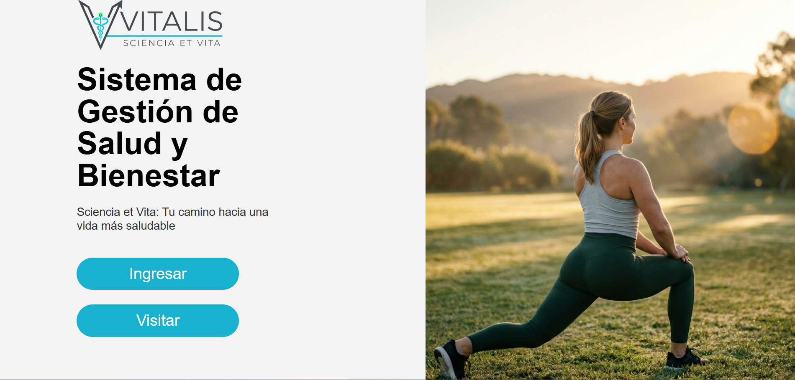
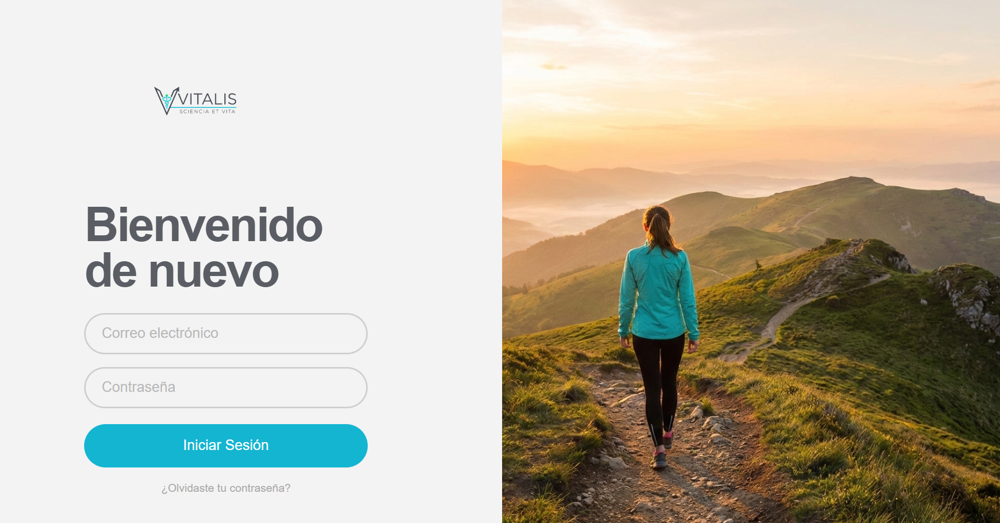
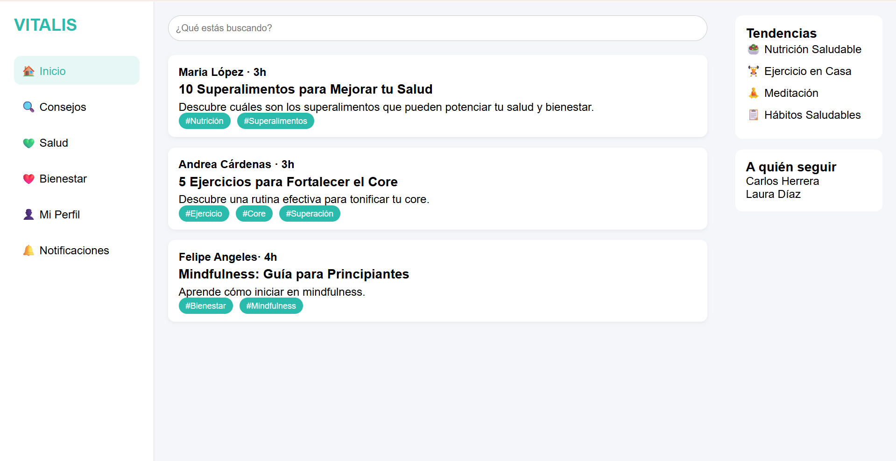
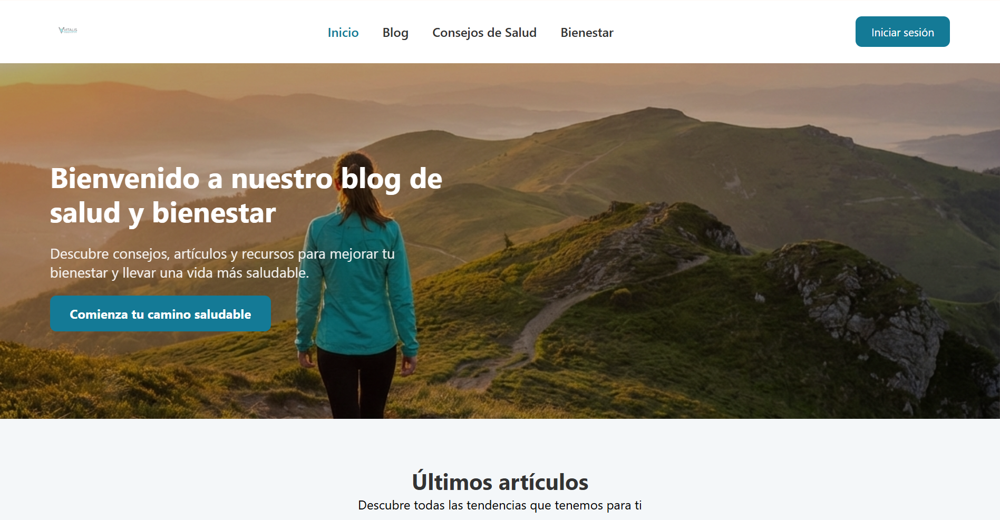
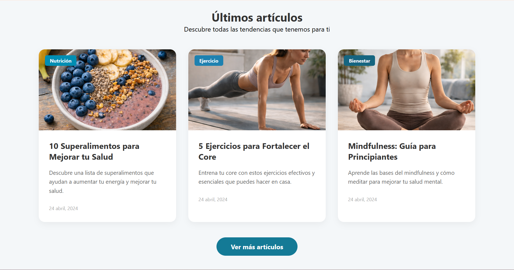

  

<h1 align="center">V  I  T  A  L  I  S</h1>

  
  
  
  

  

**Vitalis** es un proyecto que consiste en el desarrollo de una página web educativa orientada a la programación de la salud y el bienestar, basada en el Objetivo de Desarrollo Sostenible 3 (ODS 3).
La pltaforma busca brindar información clara, confiable y accesible sobre hábitos saludables, prevención de enfermedades y bienestar integral, apoyando la concientización de los usuarios mediante contenidos digitales.

## 📖 Objetivos generales

Evaluar el impacto del uso de una página web educativa sobre la ODS 3 (Salud y bienestar) en el nivel de conocimientos y en las actitudes relacionadas con la alimentación saludable, la actividad física, la prevención de enfermedades y el cuidado de la salud mental, en estudiantes de nivel escolar de la institución donde se desarrollará el proyecto, durante el periodo de implementación de la página web como recurso de apoyo al proceso de enseñanza y aprendizaje.

## 📋 Objetivos específicos
**Identificar** información confiable sobre la ODS 3 (Salud y bienestar) para su integración en la página web, mediante una metodología de análisis documental.
**Diseñar** la estructura y organización de los contenidos de la página web educativa sobre la ODS 3, mediante una metodología de análisis de requerimientos y planificación.
**Desarrollar** un prototipo funcional de la página web educativa sobre la ODS 3, mediante una metodología de trabajo en laboratorio en entorno de desarrollo.
**Evaluar** la usabilidad y comprensión de la página web por parte de los estudiantes, mediante una metodología de campo basada en pruebas con usuarios.
**Analizar** el nivel de conocimientos de los estudiantes sobre salud y bienestar antes y después del uso de la página web, mediante una metodología de análisis de datos.

# ✅ Propuesta De Valor

Vitalis nace para centralizar la gestión de salud preventiva, permitiendo a los usuarios monitorear su bienestar físico y acceder a información científica actualizada en un solo lugar

# Característica de usuario

- Registro Seguro: Formulario con validación visual y máscara de contraseña.
  
- Interfaz Adaptable: Diseño responsivo que funciona en móviles y computadoras.
  
- Sección de Noticias: Panel informativo sobre tendencias de salud y bienestar.

# Segmentos y clientes
**Vitalis** Esta plataforma está dirigida a estudiantes y jóvenes, comunidades educativas, organizaciones de salud y empresas.

# Tecnologías utilizadas
<ul>
<ill>HTML</ill>
<ill>CSS</ill>
<ill>JavaScript</ill>
<ill>SQL</ill>
</ul>

# Interfaces

Vista previa de las interfaces principales del sistema Vitalis.

  
  
  
  
  
  

## 👤Colaboradores

* Amador Benitez Juan
* Escobar Núñez Cristian Alexander
* Hernández Campos Itzel Aranzazu
* Virgen Ambriz Lucia Lorena
